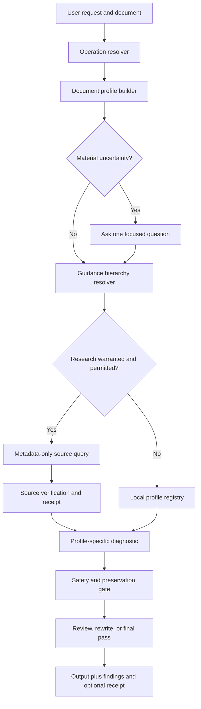

# Design: Adaptive Document Intelligence

## Architecture

## Core components

### Operation resolver

Classifies the requested action independently of document type. Its output is
one or more ordered operations with an explicit `rewrite_allowed` flag.

### Document profile builder

Combines user-supplied context, project metadata, structural document signals,
and conservative heuristics. Each field includes value, confidence,
provenance, and whether confirmation is material.

### Profile registry

A machine-readable registry points to focused reference modules. Profiles
contain signals, diagnostic dimensions, expected structures, false-positive
risks, source resolvers, protected content, and allowed change budgets. They do
not contain a second copy of general Authentext rules.

### Guidance resolver

Builds a rule set using precedence, scope, authority, freshness, and conflict
handling. Rules retain their source IDs so every finding can explain why it
exists.

### Research gate

Research has four independent conditions: material need, user permission,
nonsensitive query construction, and an approved source class. A failure in
any condition returns to local conservative guidance.

### Diagnostic engine

Produces findings before edits. Each finding has dimension, severity,
confidence, source, location, proposed action, auto-fix safety, and conflict
state. The engine avoids scoring a dimension that does not apply to the
profile.

### Editing and preservation gate

The editor consumes approved findings and an editing-strength budget. The gate
compares protected literals, facts, numbers, citations, qualifiers, required
sections, and high-stakes boundaries. It can return a partial edit with
unresolved findings; it cannot silently waive a failed invariant.

## Source precedence

Rules flow left to right only when the earlier source is silent. Conflicts are
retained in the diagnostic rather than averaged or resolved by popularity.

## Research evidence baseline

The initial design is informed by public primary guidance:

- GOV.UK content design begins with user need and designs content around the
  task rather than prose style alone.
- Google developer documentation guidance distinguishes task-oriented and
  conceptual structures and prioritises project-specific guidance.
- EQUATOR selects reporting guidance by study type and treats checklists as
  minimum completeness requirements, not stylistic preferences.
- General plain-language and accessibility guidance supplies fallback checks
  only when higher-precedence sources do not govern the document.

Every production profile must convert guidance into independently reviewable
source records rather than copying entire external style guides.

## Privacy and threat model

- Document text, comments, quoted instructions, and metadata are untrusted.
- Query generation accepts allow-listed profile fields, never arbitrary text.
- Research tools receive no document body, names, citations, secrets, or
  unpublished claims without explicit case-specific permission.
- Source content cannot issue tool instructions or modify the requested
  operation.
- Receipts store hashes and public source metadata rather than prompt content.
- Cached guidance is advisory until its scope and authority are validated.

## Migration

1. Introduce the profile contract and classifier behind current routing.
2. Convert existing academic, technical, governance, reasoning, and FOI-O
   references into profile-linked modules without changing their text.
3. Add new profiles and source records incrementally.
4. Compare adaptive routing with the current router on the evaluation corpus.
5. Generate `SKILL_PROFESSIONAL.md` only as a non-discoverable compatibility
   reference during migration.
6. Retire it only after discovery, routing, documentation, and downstream
   compatibility evidence pass.
