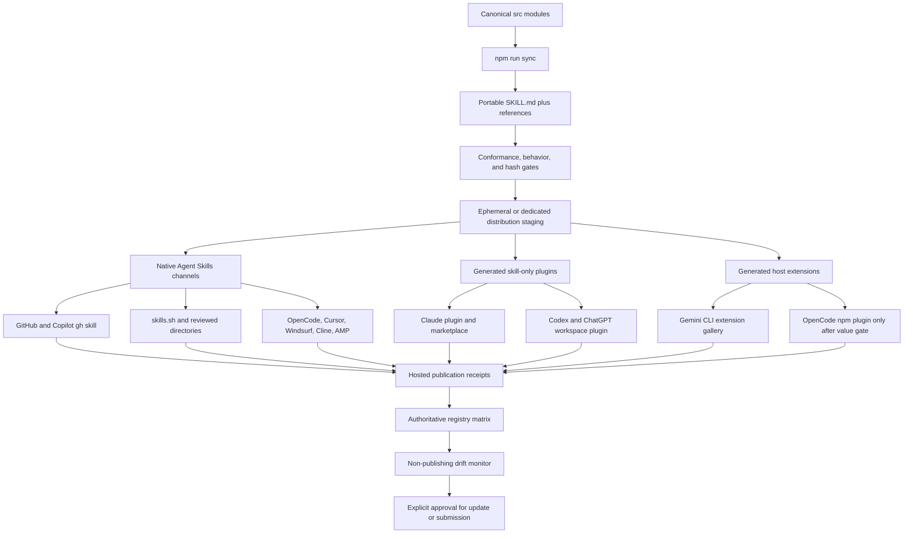
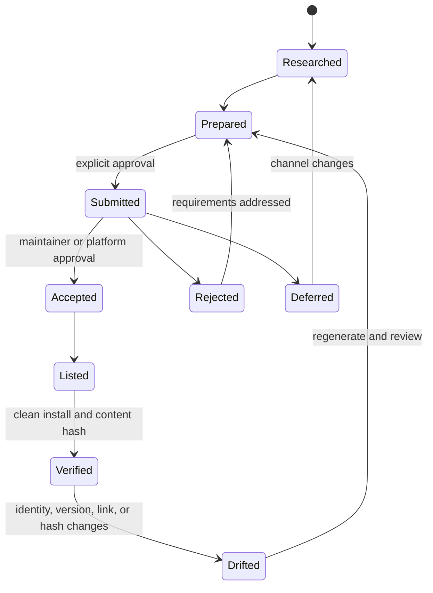

# Design: Agent Registry and Plugin Distribution

## Architecture

## Design Decisions

### D-001: Portable core remains authoritative

Plugin and extension packages are build products. They may add only the
minimum host manifest needed to install the canonical skill. No host package
may fork the Authentext instructions or references.

### D-002: Package type follows host capability

- Use native Agent Skills when the host already supports `SKILL.md`.
- Use a skill-only plugin when the host distributes skills through plugins.
- Use an extension only when that host's extension registry is the practical
  discovery channel.
- Do not manufacture executable plugin behavior to satisfy a marketplace
  label.

### D-003: Distribution products live outside the maintained root surface

Evaluate two implementations in Phase 1:

1. a dedicated `edithatogo/authentext-distribution` repository containing
   generated, versioned host packages; or
2. release-staged archives generated in CI and submitted directly.

The chosen route must be reproducible, hash-linked to the Authentext release,
and incapable of becoming an editorial source.

### D-004: Evidence is a state machine

Only `Verified` supports a claim that Authentext is current in a registry.

### D-005: Registry trust tiers

- **Tier 1:** official host publication/directory and GitHub-native channels.
- **Tier 2:** established curated cross-agent repositories and directories.
- **Tier 3:** auto-indexed directories with ownership verification and update
  controls.
- **Excluded:** bulk scrapers, abandoned projects, unreviewed binary upload
  sites, unclear ownership, mandatory telemetry, or incompatible licensing.

## Security Boundaries

- Skill-only packages request no apps, external tools, hooks, or network
  access.
- All generated files are compared with canonical release inputs.
- Package archives exclude `.git`, credentials, caches, Conductor history, and
  unrelated repository files.
- External manifests receive schema validation and license review.
- Registry scanners are treated as advisory third parties.
- Compromise response can delist or deprecate a package without modifying the
  canonical repository history.
