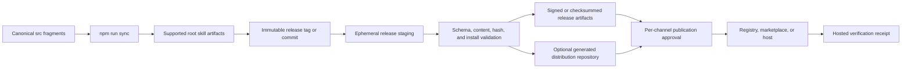

# ADR: Generated Distribution Architecture and Trust Boundary

- **Status:** Accepted for Phase 1 implementation
- **Date:** 2026-08-02
- **Decision owners:** Authentext maintainers
- **Scope:** Agent Skill registries, host plugin packages, extension packages,
  marketplace metadata, and their publication receipts

## Context

Authentext is authored in `src/` and compiled into the supported root skill
artifacts by `npm run sync`. Some destinations can consume that portable skill
directly, while others require a plugin, extension, marketplace manifest, or
repository URL. Checking those host wrappers into this repository would widen
the maintained surface and create competing copies of the instructions.

Two packaging models were considered:

1. generate host packages only as release-staged archives; or
2. maintain a dedicated distribution repository containing generated host
   packages.

The design must also distinguish creating a package from publishing it.
External submissions, mutations, uploads, npm publications, tags, and releases
remain separately approved operations.

## Decision

Use **release staging as the authoritative build process**, with a **dedicated
generated distribution repository only for channels that require a repository
or benefit materially from an independently installable marketplace source**.

The Authentext repository remains the only editorial source. Host packages are
deterministic build products produced from an immutable Authentext release tag
or commit. A distribution repository, if created, is a generated projection:
it may contain validated manifests, packages, checksums, provenance, and
receipts, but it must not contain independently edited Authentext instructions.
Direct-upload channels receive the same staged artifacts without requiring a
permanent adapter tree here.

This is a hybrid deployment choice, not two sources of truth:

- release staging defines how every artifact is built and verified;
- a distribution repository is an optional publication transport;
- registry and host entries are external projections whose state is recorded
  in the authoritative registry matrix;
- no external state is considered current until its hosted identity, version,
  content hash, and installation result are verified.

## Canonical Source and Generated Content

The source chain is:

Generated packages may add only destination-required metadata and structure.
They may not alter the meaning of `SKILL.md`, fork references, or introduce
host-specific writing rules. Where a host supports native Agent Skills, the
portable package is preferred over a wrapper.

Each staged package must identify:

- the Authentext version, source tag, and source commit SHA;
- the package type and target host/channel;
- the generator version or commit;
- the included files and their cryptographic hashes;
- the license and required attribution;
- the manifest schema/version used;
- the build timestamp as metadata, not as an input to content hashes;
- validation results and, when supported, SBOM/provenance references.

## Publication and Permission Boundary

Building, validating, and inspecting packages are local or CI preparation
activities. They do not authorize an external change. The following actions
each require explicit approval immediately before execution:

- creating or transferring a public distribution repository;
- pushing generated publication content to that repository;
- opening or updating a third-party registry submission or marketplace PR;
- submitting a hosted form or changing an existing listing;
- publishing to npm or another package registry;
- uploading a plugin or extension;
- creating or moving a public tag or release; and
- deprecating, unlisting, redirecting, or renaming an external package.

Approval is scoped to the named destination, identity, version, and action. An
approval for one channel does not authorize another. CI may prepare artifacts,
run dry-runs, and detect drift, but it must not hold credentials capable of
silent cross-channel publication. Publishing jobs must use destination-scoped,
least-privilege credentials and an approval-protected environment where the
platform supports one.

Prepared, submitted, accepted, listed, and verified remain distinct states.
Only hosted evidence can advance an external entry beyond `prepared`, and only
a clean install plus identity/version/hash comparison can advance it to
`verified`.

## Threat Model and Controls

| Threat                                                                                     | Boundary or control                                                                                                                                     |
| ------------------------------------------------------------------------------------------ | ------------------------------------------------------------------------------------------------------------------------------------------------------- |
| A generated wrapper drifts from canonical instructions                                     | Regenerate from an immutable source; compare normalized content and file hashes; reject independent edits.                                              |
| A distribution repository becomes an editorial fork                                        | Mark it generated; deny manual skill-body changes in review/CI; rebuild instead of patching generated content.                                          |
| An artifact includes secrets, history, caches, or unrelated files                          | Package from an allowlist in a clean staging directory; scan archives before publication.                                                               |
| A wrapper adds unjustified code, hooks, network access, telemetry, MCP, or app permissions | Default to data-only/skill-only manifests; fail validation on capabilities outside the reviewed package profile.                                        |
| A registry or package identity is squatted or replaced                                     | Verify owner and hosted identity; pin immutable refs where possible; record package and listing URLs; monitor identity and hashes.                      |
| A compromised build or dependency changes output                                           | Pin tool versions, use lockfiles, build in clean CI, produce checksums and provenance, and reproduce the package independently before release.          |
| A marketplace schema changes                                                               | Pin the researched schema/version and date; validate again against current official documentation immediately before submission.                        |
| Submission is reported as publication                                                      | Enforce the governed status vocabulary and require destination-specific hosted receipts.                                                                |
| Broad credentials permit unintended publication                                            | Use destination-scoped tokens, protected environments, short-lived credentials where available, and no credentials in artifacts or receipts.            |
| A malicious or low-trust directory republishes content                                     | Treat third-party scanners as advisory; do not claim endorsement; prefer removal/deprecation requests without changing canonical history.               |
| A stale predecessor listing misrepresents Authentext                                       | Request replacement or redirect only where ownership is established; otherwise retain the maintainer disposition and avoid claiming control.            |
| A compromised release must be withdrawn                                                    | Stop further submissions, revoke scoped credentials, deprecate/delist affected projections, preserve evidence, and issue a corrected canonical release. |

No generated skill-only package may request runtime permissions. If a future
host package needs executable behavior or additional privileges, it requires a
separate architecture and security review and cannot inherit this decision by
default.

## Release Flow

1. Select an immutable Authentext release tag and resolve its commit SHA.
2. Run the canonical sync and repository validation from a clean checkout.
3. Create a clean, ephemeral staging directory using an explicit file
   allowlist and destination-specific templates.
4. Generate portable, plugin, extension, and marketplace artifacts without
   editing canonical instruction content.
5. Validate schemas, licenses, links, versions, identities, permissions,
   content equivalence, and archive contents.
6. Produce package manifests, hashes, install-test results, and provenance.
7. Rebuild independently and require byte-identical output except for fields
   explicitly classified as non-reproducible metadata.
8. Optionally update a generated distribution-repository branch or candidate
   commit, without publishing it, when a host needs repository transport.
9. Stop at the destination-specific approval gate and present the candidate
   artifact, diff, requested permissions, target identity, and validation
   evidence.
10. After approval, publish only to the approved destination and record the
    submission receipt.
11. Observe the host-controlled acceptance/listing state; do not infer it.
12. Perform a clean hosted install, compare identity/version/hashes, and record
    a verification receipt in the registry matrix.
13. Run non-publishing drift monitors. Any drift returns the channel to a
    reviewable preparation state rather than triggering an automatic update.

## Distribution Repository Rules

If a dedicated distribution repository is needed, its initial creation and
every public release remain approval-gated. It must:

- state prominently that content is generated from Authentext;
- link each package to its immutable canonical source;
- accept changes only through the generator workflow;
- protect generated package paths from unverified manual edits;
- contain no credentials, browser state, Conductor history, or unrelated
  source files;
- preserve versioned checksums and provenance without making receipts an
  editorial source; and
- support deprecation/removal without rewriting canonical Authentext history.

The generated repository is not required for native Agent Skills channels or
direct uploads. It should not be created until at least one approved target has
a concrete repository-transport requirement or a reviewed operational benefit.

## Alternatives Considered

### Check host adapter trees into this repository

Rejected. It expands the maintained surface, encourages instruction drift,
and conflicts with the repository rule against compatibility bundles and
install shims.

### Use only release-staged archives

Rejected as a universal rule. It is the default and authoritative build route,
but some marketplaces and extension galleries require or strongly benefit from
a repository-backed install source. Forcing archive-only delivery would block
those legitimate channels or produce ad hoc repositories later.

### Use only a dedicated distribution repository

Rejected. Native and direct-upload channels do not need another repository,
and making it mandatory would create permanent maintenance and compromise
surface before there is a destination requirement.

### Maintain hand-authored packages in a distribution repository

Rejected. Reviewable host metadata is allowed, but the packaged skill body
must always be regenerated from the canonical immutable release. Manual edits
would create a second editorial source.

### Publish automatically after every canonical release

Rejected. External platforms have different permissions, review processes,
schemas, and risk profiles. Drift detection and package preparation may be
automated; external state changes remain explicit per-channel decisions.

### Build executable plugins for every host

Rejected. Native Agent Skills or skill-only packages satisfy the use case.
Executable wrappers, telemetry, hooks, apps, or MCP capabilities would add
permissions and supply-chain risk without product value.

## Consequences

- Authentext retains one editorial source and one reproducible packaging path.
- Host-specific installation is possible without adding adapter bundles to
  the maintained repository surface.
- A generated distribution repository can be introduced deliberately when a
  destination proves the need, rather than speculatively.
- Publication remains slower than fully automatic release fan-out because
  every external mutation is reviewed and explicitly approved.
- The registry matrix and hosted receipts are necessary operational records;
  a green local build alone cannot establish external publication or currency.
- Any package that needs code or permissions falls outside this ADR and must
  undergo a new design and threat review.
