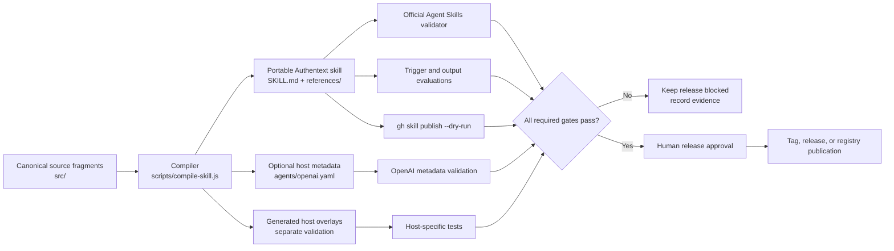
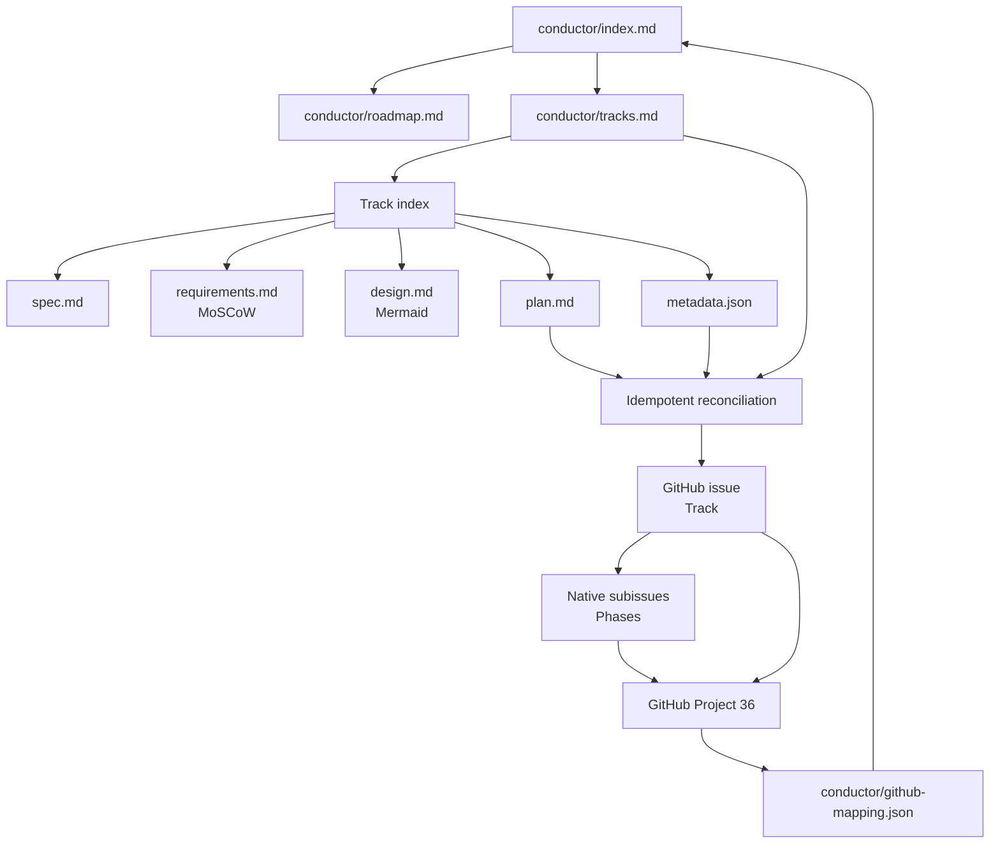
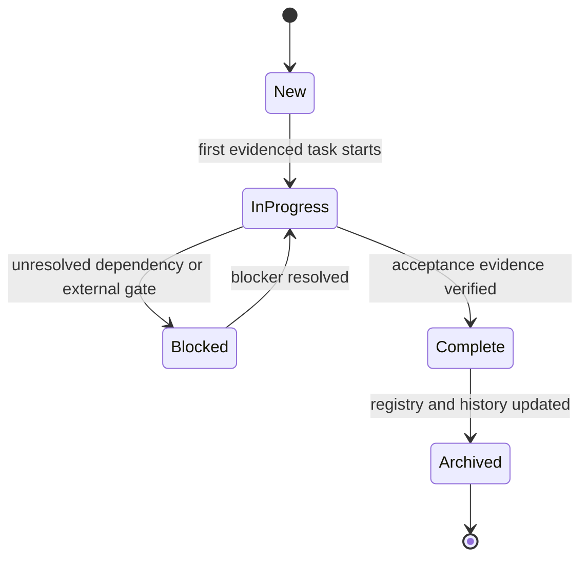

# Design: Portable Core, Host Layers, and Conductor Mirror

GitHub implementation hierarchy:
[#66](https://github.com/edithatogo/authentext/issues/66) with native phase
subissues [#67–#72](https://github.com/edithatogo/authentext/issues/67).

## Design principles

1. Portable first: the Agent Skills directory must validate without knowing the
   host.
2. Generated, not duplicated: canonical fragments produce the runtime skill and
   optional overlays.
3. Evidence before state: tests, hosted runs, and registry previews establish
   outcomes; checkboxes and project fields coordinate them.
4. Experimental isolation: preview features can accelerate work but cannot
   silently become release dependencies.

## Build and distribution architecture

The portable package contains no broad host permission grants. Optional
metadata and overlays are generated from the same source, but they cannot make a
failing portable package releasable.

## Conductor and GitHub synchronization

Hidden markers provide stable identities:

- `<!-- authentext-conductor-track-id: <track_id> -->`
- `<!-- authentext-conductor-phase-id: <track_id>.phase<N> -->`

The reconciliation process must search markers before creating anything. It may
add or update issue/project records, but it must not close an implementation
issue solely because an archive path or checkbox exists.

## State model

GitHub state mirrors this model:

- `New` and `In Progress` remain open.
- `Blocked` remains open with the blocker recorded.
- `Complete` may be closed only when repository-owned acceptance is evidenced.
- `Archived` historical tracks are closed ledger items; stale metadata is
  disclosed rather than rewritten.

## Experimental integration

Gemini preview task tracking, worktrees, context management, extension
reloading, and model steering are workspace aids. They are intentionally
outside the durable state diagram. If disabled or removed, Conductor files and
GitHub reconciliation must still work.

## Security and rollback

- Skill and extension sources are pinned or recorded by commit/tag.
- Workspace trust and tool authorization remain explicit user decisions.
- Experimental settings are reversible by deleting their individual keys.
- The Gemini extension stays pinned to `conductor-v0.4.1` until upstream main
  restores a compatible manifest.
- GitHub mutations use stable markers and return a mapping receipt so reruns are
  idempotent.
- Release actions remain outside this track until separately approved.
