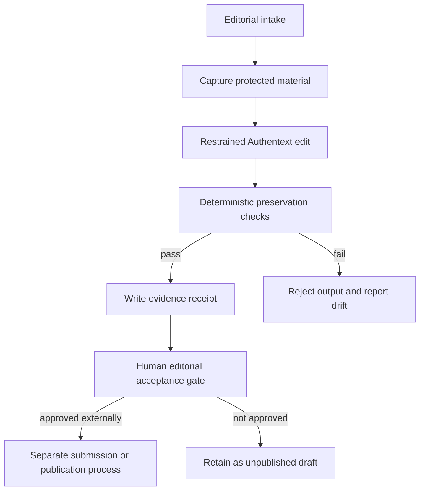

# Design: FOI-O Editorial Workflow

## Components

- Canonical academic guidance describes when and how the workflow is invoked.
- A repository script compares protected semantic tokens between source and
  edited text and emits a deterministic JSON receipt.
- Tests exercise valid preservation and each fail-closed boundary.
- Conductor and GitHub retain implementation evidence; they do not confer
  editorial or publication approval.
