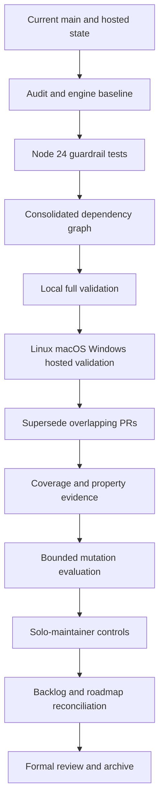
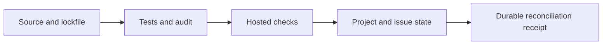

# Design: Post-Release Security and Quality Frontier

## Control flow

## Evidence layers

No later layer substitutes for an earlier one. A green Project field cannot
replace tests, and a local lockfile cannot establish hosted automation state.

## Dependency decision model

1. Capture the current audit and tool-engine baseline.
2. Add executable assertions for the supported Node line and workflow inputs.
3. Reproduce PR #219's coherent dependency set on a current-main branch.
4. Run audit, sync, lint, type, tests, and portable/host validation.
5. Merge only the coherent replacement; close overlapping lockfile PRs with an
   evidence link.

## Solo-maintainer control model

- Required automated checks may block merges.
- Force-push and deletion protections should be enabled where owner recovery is
  preserved.
- No approval count, CODEOWNERS, team assignment, or second person is required.
- Dependency bots remain additive until one is proven to replace the other.

## Rollback

- Dependency/runtime changes remain isolated in reviewable commits and a PR.
- Ruleset changes must record prior configuration and exact rule identifiers.
- Bot changes are reversed before removing the incumbent update path if hosted
  replacement evidence disappears.
- Experimental quality tools remain optional until their signal and runtime are
  measured.
