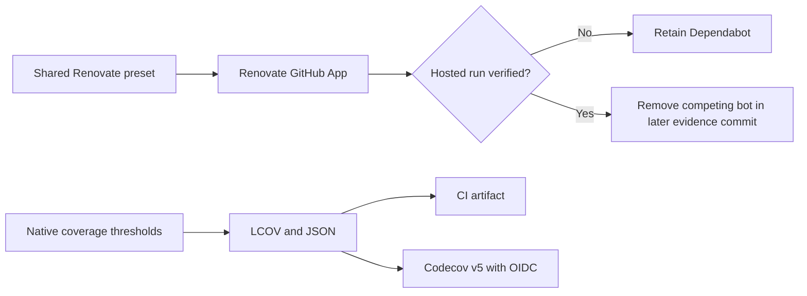

# Design: Renovate and Codecov Verification

```mermaid
flowchart LR
  P["Shared Renovate preset"] --> R["Renovate GitHub App"]
  R --> V{"Hosted run verified?"}
  V -->|No| D["Retain Dependabot"]
  V -->|Yes| C["Remove competing bot in later evidence commit"]
  T["Native coverage thresholds"] --> L["LCOV and JSON"]
  L --> A["CI artifact"]
  L --> O["Codecov v5 with OIDC"]
```
